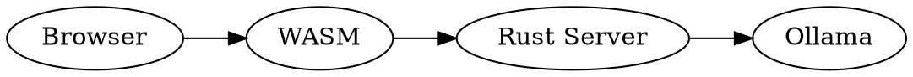
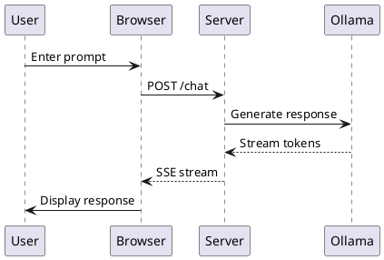
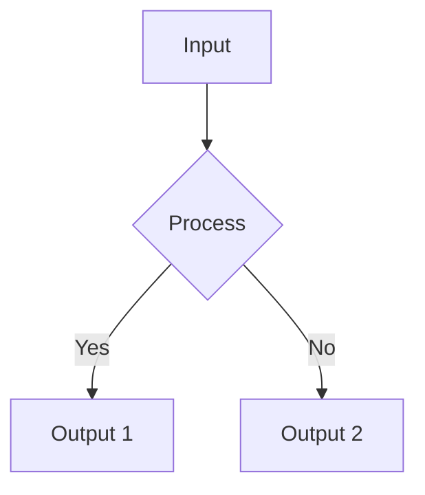

# GameCode Web Design Document

## Core Concept: Interactive Notebook Terminal

A scrolling notebook interface that combines terminal-like interaction with rich media rendering, inspired by Jupyter notebooks but with a unique terminal aesthetic.

```
┌─────────────────────────────────────────┐
│ [Older messages scroll up...]           │
│                                         │
│ ┌─────────────────────────────────┐     │
│ │ > What is dark matter?          │     │  <-- User input (blue bubble)
│ └─────────────────────────────────┘     │
│                                         │
│ ┌─────────────────────────────────┐     │
│ │ Dark matter constitutes approx.. │     │  <-- Text response (gray bubble)
│ │ 85% of the universe's matter... │     │
│ └─────────────────────────────────┘     │
│                                         │
│ ┌─────────────────────────────────┐     │
│ │ > Show me the architecture       │     │
│ └─────────────────────────────────┘     │
│                                         │
│ ┌─────────────────────────────────┐     │
│ │ Here's the system architecture:  │     │
│ │                                 │     │
│ │ ```dot                          │     │
│ │ digraph G {                     │     │
│ │   A -> B -> C                   │     │
│ │ }                               │     │
│ │ ```                             │     │
│ │                                 │     │
│ │ [Rendered Graphviz Diagram]     │     │  <-- Auto-rendered diagram
│ │  ┌───┐    ┌───┐    ┌───┐      │     │
│ │  │ A │───▶│ B │───▶│ C │      │     │
│ │  └───┘    └───┘    └───┘      │     │
│ └─────────────────────────────────┘     │
│                                         │
│ > _ [Cursor can be on any line]        │  <-- Active input area
└─────────────────────────────────────────┘
```

## Key Design Principles

### 1. Unified Input/Output Stream
- Single scrollable area for all interaction
- Cursor can be positioned on any line
- New content pushes old content up
- Terminal-like feel with rich capabilities

### 2. Content Types (Cells)
```rust
enum CellContent {
    UserInput { text: String, timestamp: DateTime },
    TextResponse { text: String, provider: String },
    Image { url: String, alt: String, dimensions: (u32, u32) },
    Chart { data: JsonValue, chart_type: ChartType },
    Table { headers: Vec<String>, rows: Vec<Vec<String>> },
    Code { language: String, content: String, rendered: Option<RenderedDiagram> },
    Diagram { format: DiagramFormat, source: String, rendered: RenderedDiagram },
    Error { message: String },
    Loading { message: Option<String> },
}

enum DiagramFormat {
    Graphviz,    // DOT language
    PlantUML,    // UML diagrams
    Mermaid,     // Flowcharts, sequence diagrams
    D2,          // Modern diagram language
    Excalidraw,  // Hand-drawn style
}

struct RenderedDiagram {
    svg: String,
    interactive: bool,
    error: Option<String>,
}
```

### 3. Diagram Detection & Rendering

The system automatically detects and renders diagrams from:

1. **Fenced code blocks** with diagram languages:
   ````markdown
   ```dot
   digraph G { A -> B }
   ```
   
   ```plantuml
   @startuml
   Alice -> Bob: Hello
   @enduml
   ```
   ````

2. **Inline diagram descriptions** that LLMs might generate:
   ```
   "Here's a flow: Start -> Process -> Decision -> End"
   ```

3. **Structured data** that can be visualized:
   ```json
   {"nodes": ["A", "B"], "edges": [["A", "B"]]}
   ```

### 4. WASM Diagram Renderers

We'll use WASM-compiled versions of popular diagram tools:

- **Graphviz-WASM**: For DOT graphs
- **PlantUML-WASM**: For UML diagrams  
- **Mermaid**: Already has JS version
- **D2**: Modern, has WASM target
- **Custom Rust renderers**: For simple diagrams

### 5. Smart Rendering Pipeline

```rust
trait DiagramRenderer {
    fn can_render(&self, format: &DiagramFormat) -> bool;
    fn render_to_svg(&self, source: &str) -> Result<String, RenderError>;
    fn supports_interaction(&self) -> bool;
}

impl NotebookCell {
    fn process_content(&mut self) {
        // 1. Check for code blocks
        if let Some((lang, code)) = extract_code_block(&self.text) {
            if let Some(format) = DiagramFormat::from_language(&lang) {
                self.render_diagram(format, code);
            }
        }
        
        // 2. Check for inline diagram syntax
        if let Some(diagram) = detect_inline_diagram(&self.text) {
            self.render_diagram(diagram.format, diagram.source);
        }
        
        // 3. Check for structured data
        if let Ok(data) = serde_json::from_str::<GraphData>(&self.text) {
            self.render_graph(data);
        }
    }
}
```

### 6. Interactive Features

- **Zoom/Pan**: For large diagrams
- **Export**: Save as SVG/PNG
- **Edit**: Double-click to edit source
- **Copy**: Copy diagram source or rendered image
- **Fullscreen**: Expand complex diagrams

### 7. LLM Integration Features

The LLM can return diagrams in multiple ways:

```markdown
// Example 1: Architecture diagram


// Example 2: Sequence diagram


// Example 3: Data flow

```

### 8. Performance Optimizations

1. **Lazy Rendering**: Diagrams render only when visible
2. **Caching**: Rendered SVGs are cached
3. **Progressive**: Show source first, then render
4. **Async**: Rendering doesn't block UI
5. **Fallback**: Show source if rendering fails

## Implementation Phases

### Phase 1: Core Notebook
- Cell-based architecture
- Text input/output
- Markdown rendering
- Code syntax highlighting

### Phase 2: Diagram Support
- Graphviz integration
- Mermaid support
- Auto-detection of diagram code
- SVG rendering and caching

### Phase 3: Advanced Diagrams
- PlantUML
- D2 diagrams
- Interactive features
- Custom diagram types

### Phase 4: Data Visualization
- Charts from data
- Tables with sorting
- CSV/JSON visualization
- Real-time data updates

## Benefits

1. **Power of Notebooks**: Like Jupyter but in the browser
2. **Terminal Simplicity**: Familiar interface
3. **Rich Visualizations**: Diagrams make complex ideas clear
4. **LLM-Native**: Designed for AI responses with diagrams
5. **Extensible**: Easy to add new diagram types

This design creates a unique environment where LLMs can "think visually" and users can interact with both text and diagrams seamlessly.